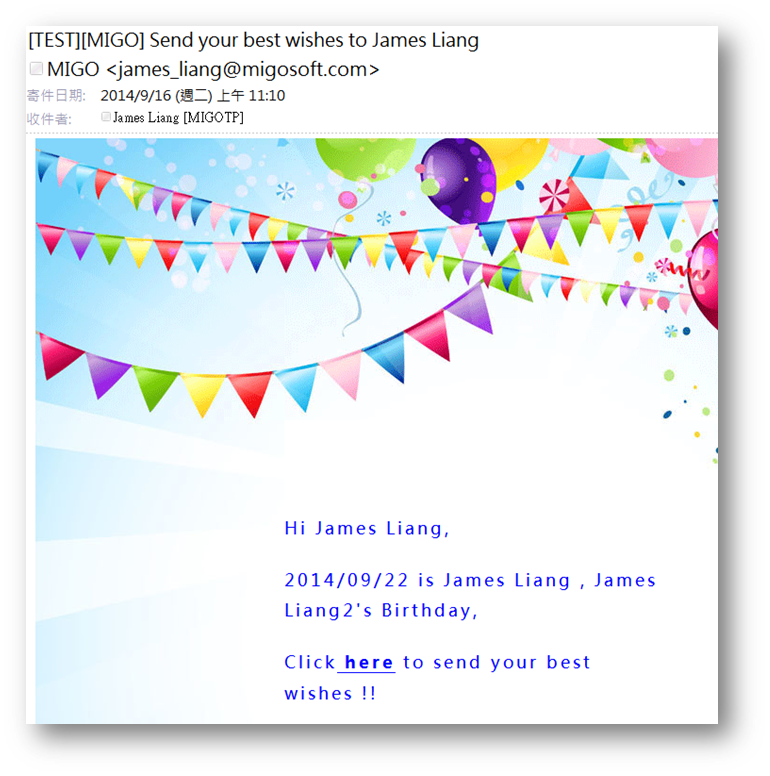
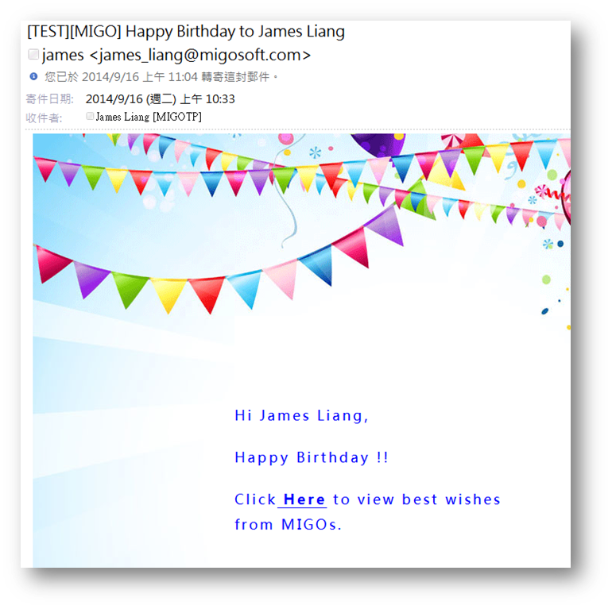
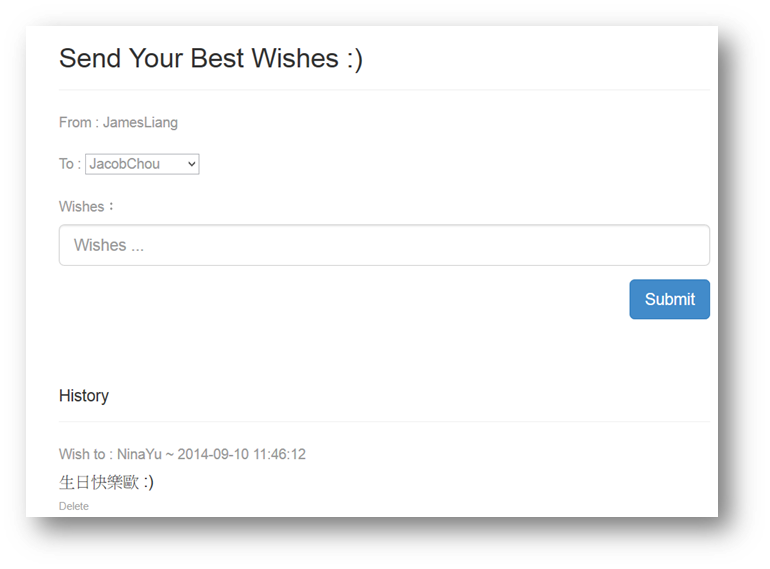
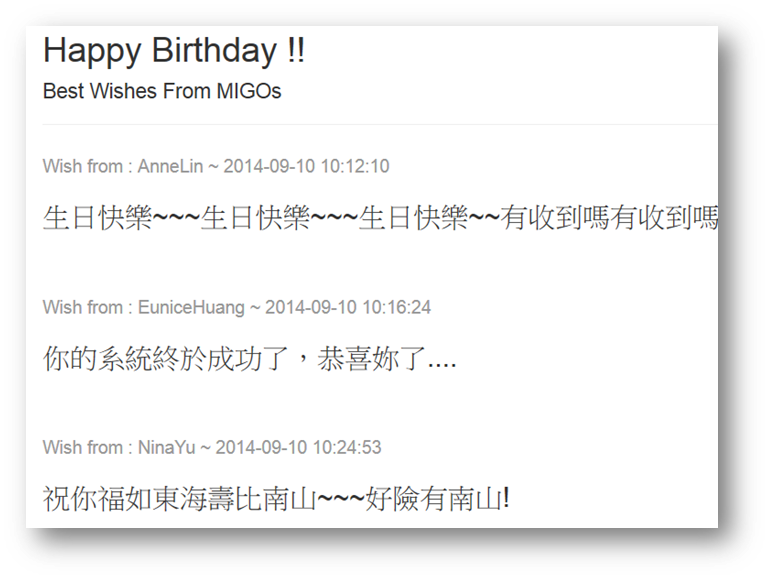

## 生日祝福留言版

程式語言：PHP (Laravel + AngularJS)

生日表：wishes

## 主要功能

	預設可以留言給未來7天生日的名單

	可以看到自己送出過的所有祝福(看不到別人的祝褔)

	可以刪除自己送出過的任何祝福(不可刪除別人祝褔)

	可以重複送出多筆祝福給同一個生日員工

	生日員工不可刪除別人給自己的祝福留言

## 整合MIGO EDM系統

### 發給其他員工給予壽星祝福(一星期前)

###發給壽星(當天)

###生日留言

###壽星讀取祝福
